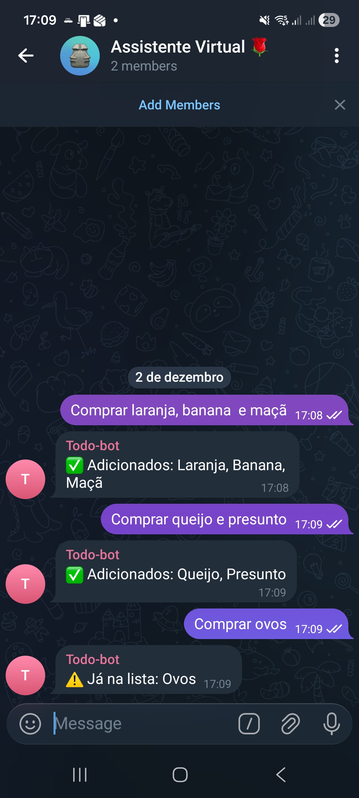
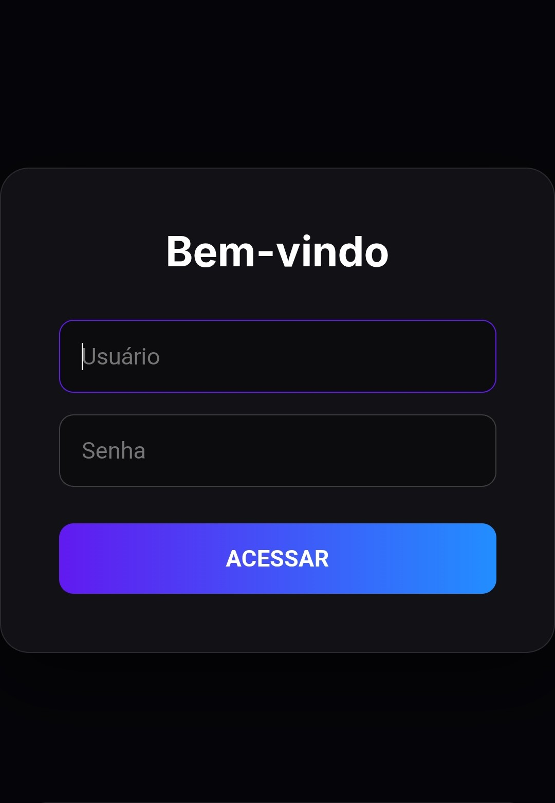

# 🛒 FamilyOS: ToDo Market & List
### Software House Autônoma de Gestão Doméstica

O **FamilyOS** é um sistema híbrido de gestão doméstica inteligente, focado em eliminar a **fricção cognitiva e operacional** na organização familiar. O foco atual é o Módulo de Compras, que utiliza Inteligência Artificial para transformar áudios no Telegram em uma **Lista de Compras Web Interativa**.

> **Versão Atual:** 1.2 (Stable Persistence)
> **Stack:** Python Flask, Docker, SQLite (WAL), Google Gemini Pro.
> **Status:** ✅ Produção

---

## 💡 Showcase: O Fluxo de Uso

### 1. Entrada de Dados "Zero UI" (Telegram)
A interface de entrada é o Telegram. O sistema aceita áudios com linguagem natural ("preciso de 3 ovos e uma caixa de leite") ou texto direto. O bot confirma o recebimento e avisa se o item foi adicionado ou se já existia na lista.


### 2. O Cérebro (Orquestração n8n)
O **n8n** atua como o sistema nervoso, recebendo o webhook do Telegram, processando o áudio via Whisper e enviando para a API Python estruturar os dados com a IA do Google.


### 3. Segurança (Acesso Familiar)
O sistema conta com uma camada de autenticação via Cookies de Sessão para garantir que apenas a família tenha acesso à gestão.


### 4. A Lista Inteligente (Web App Mobile-First)
Uma interface limpa com design **Cyberpunk Dark Neon**. O sistema agrupa automaticamente os itens por categorias (Padaria, Laticínios, Higiene) para otimizar o trajeto dentro do supermercado.


---

## ✨ Detalhes da Experiência (UX)

O FamilyOS foi desenhado para ser usado com uma mão só enquanto se empurra um carrinho de mercado.

### Feedback Visual Instantâneo
Ao marcar um item, ele recebe um feedback visual imediato (check verde neon e vibração tátil). A sincronização com o servidor acontece em segundo plano (Optimistic UI).


### Edição Rápida (Long Press)
Errou o nome ou a categoria? Não precisa apagar. Segure o dedo sobre o item por **800ms** para abrir o Modal de Edição. O campo de categoria possui *autocomplete* inteligente.


### Limpeza de Carrinho (Soft Delete)
Ao finalizar as compras, o botão "Limpar Carrinho" arquiva os itens comprados, mantendo-os no banco de dados para histórico futuro, mas limpando a visualização principal.


---

## 🏗️ Arquitetura Técnica

A arquitetura evoluiu para um **Microserviço Híbrido Resiliente**, hospedado em Docker. A versão 1.2 foca em persistência de dados e estabilidade de IA.


### Componentes Chave

| Componente | Função | Tecnologias Chave |
| :--- | :--- | :--- |
| **Interface** | Captura de áudio/texto | Telegram Bot API |
| **Orquestrador** | Transcrição e Roteamento | n8n, OpenAI Whisper |
| **Inteligência** | Extração e Sanitização | **Google Gemini Pro**, LangChain |
| **Backend** | Regras de Negócio | Python Flask, Gunicorn, SQLAlchemy |
| **Persistência** | Banco de Dados Resiliente | **SQLite (WAL Mode)** |
| **Frontend** | Visualização | HTML5, CSS3 (Glassmorphism), JS Vanilla |

---

## 🛠️ Instalação e Deploy

O projeto utiliza **Docker Compose** para orquestração.

### 1. Configuração de Ambiente (.env)
Crie um arquivo `.env` na raiz do projeto (ao lado do `docker-compose.yml`) com suas credenciais:

```bash
TZ=America/Sao_Paulo
SECRET_KEY=sua_chave_secreta_aqui
DATABASE_URL=sqlite:////app/data/familyos.db
GOOGLE_API_KEY=sua_chave_do_google_aqui
````

### 2\. Subir a Aplicação

```bash
docker compose up -d --build familyos-app
```

### 3\. Resetar/Criar Usuários (Primeiro Uso)

Para criar o banco de dados e os usuários padrão (`thiago` / `debora`):

```bash
docker exec familyos_app python src/reset_db.py
```

-----

## 📂 Estrutura de Arquivos

Para garantir que o deploy funcione, mantenha esta estrutura:

```text
/opt/n8n-traefik/          # Raiz da VPS
├── .env                   # Variáveis de Ambiente (Segurança)
├── docker-compose.yml     # Orquestrador
└── familyos/              # Projeto FamilyOS
    ├── Dockerfile         # Receita da Imagem
    ├── data/              # Banco de Dados (Persistente)
    └── src/               # Código Fonte
        ├── app.py         # Backend Flask
        ├── static/        # CSS/Imagens
        └── templates/     # HTML (Jinja2)
```

-----

## 🗺️ Roadmap e Status

| Sprint | Foco | Status |
| :--- | :--- | :--- |
| **Sprint 1-6** | MVP e Frontend Básico | ✅ Concluído |
| **Sprint 7** | **Persistência, WAL Mode e UX Mobile** | ✅ Concluído (v1.2) |
| **Sprint 8** | Feedback de IA no Frontend (WebSocket) | 🚧 Planejado |
| **Sprint 9** | Múltiplas Listas (Churrasco/Farmácia) | 🔮 Futuro |

-----

**Desenvolvido por:** Thiago Scutari.
**Powered by:** Python, Docker & Coffee.

```