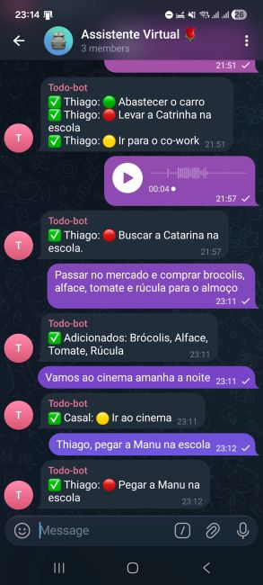
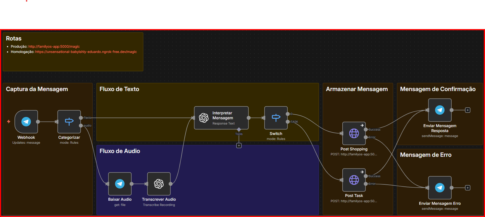
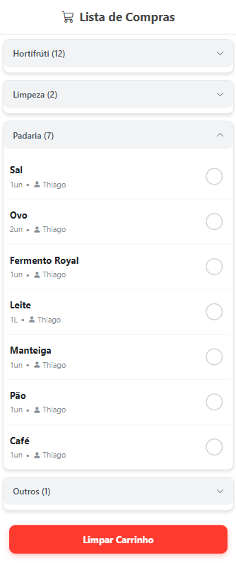

# 🛒 FamilyOS: ToDo Market & List
### Software House Autônoma de Gestão Doméstica

O **FamilyOS** é um sistema híbrido de gestão doméstica inteligente, focado em eliminar a **fricção cognitiva e operacional** na organização familiar. O foco inicial é o Módulo de Compras, que utiliza Inteligência Artificial para transformar áudios no Telegram em uma **Lista de Compras Web Interativa**.

---

## 💡 O Que Ele Faz? (Showcase)

### 1. Você fala no Telegram (Voz ou Texto)
O sistema aceita listas complexas e áudios com ingredientes misturados.


### 2. A Mágica Acontece (Backend + IA)
O n8n orquestra a transcrição e envia para nossa API Python, que usa Gemini para estruturar os dados.


### 3. A Lista Aparece Pronta (Web App)
Uma interface mobile-first para usar no mercado, com agrupamento inteligente por categorias.


---

## 🏗️ Arquitetura Técnica (Sprint 5 - Produção)

A arquitetura evoluiu para um **Monólito Modular Inteligente**, hospedado em VPS com Docker e Traefik.

```

┌─────────────────┐    ┌──────────────────┐    ┌───────────────────────────┐
│   INTERFACE     │    │   ORQUESTRADOR   │    │    CÉREBRO & FRONTEND     │
│                 │    │                  │    │                           │
│  • Telegram     │───▶│  • n8n           │───▶│  • Flask (API + Web)      │
│  • (Voz/Texto)  │    │  • Whisper       │    │  • Gemini AI (NLP)        │
└─────────────────┘    └──────────────────┘    │  • SQLAlchemy (DB)        │
└─────────────┬─────────────┘
│
▼
┌──────────────────┐
│    MEMÓRIA       │
│                  │
│  • SQLite        │
│  (Volume Docker) │
└──────────────────┘

````

### Componentes Chave

| Componente | Função | Tecnologias Chave |
| :--- | :--- | :--- |
| **Interface de Entrada** | Captura de áudio/texto | Telegram Bot API |
| **Orquestrador** | Transcrição e Roteamento | n8n, OpenAI Whisper |
| **Cérebro (NLP)** | Extração de itens e Categorização | Google Gemini 2.5 Flash-Lite, LangChain |
| **Backend** | Regras de Negócio e Persistência | Python Flask, Gunicorn, SQLAlchemy |
| **Frontend** | Visualização e Controle (Check-off) | HTML5, CSS3 (Mobile-First), Jinja2, JS Fetch |
| **Infraestrutura** | Deploy e Segurança | Docker Compose, Traefik (Reverse Proxy + SSL) |

---

## 🎯 Funcionalidades do Módulo de Compras

### 1. Entrada Inteligente (`POST /magic`)
* **Processamento de Linguagem Natural:** Entende frases complexas ("3kg de costela para churrasco").
* **Normalização:** Converte plurais para singular e padroniza unidades.
* **Anti-Duplicidade:** Se o item já está na lista, ele não duplica.
* **Identidade:** Rastreia quem pediu o item (Thiago ou Esposa).

### 2. Interface de Compras (`GET /`)
* **Design No-Zoom:** Checkboxes grandes e áreas de toque otimizadas para celular.
* **Organização:** Agrupamento automático por categorias (Hortifrúti, Padaria, etc.).
* **Feedback Visual:** Itens comprados ficam riscados instantaneamente.

### 3. Gestão de Estado (`POST /toggle_item` & `/clear_cart`)
* **Persistência:** O status (pendente/comprado) é salvo no banco em tempo real.
* **Limpeza:** Botão para arquivar itens comprados ao final da feira.

---

## 🛠️ Setup e Desenvolvimento

Para rodar o projeto localmente:

1.  **Clonar o Repositório:**
    ```bash
    git clone [https://github.com/ThiagoScutari/todo_market_list.git](https://github.com/ThiagoScutari/todo_market_list.git)
    cd todo_market_list
    ```

2.  **Configurar Ambiente:**
    * Crie o ambiente virtual e instale as dependências:
        ```bash
        pip install -r requirements.txt
        ```

3.  **Configurar Chaves (`.env`):**
    * Crie um arquivo `.env` na raiz com suas chaves (GOOGLE_API_KEY).

4.  **Inicializar Banco de Dados:**
    * Execute o script que cria o SQLite e popula as categorias base:
    ```powershell
    python src/reset_db.py
    ```

5.  **Rodar a Aplicação:**
    ```powershell
    python src/app.py
    ```
    * Acesse o Frontend: `http://localhost:5000`

---

## 🗺️ Roadmap de Desenvolvimento

| Sprint | Foco | Status |
| :--- | :--- | :--- |
| **Sprint 1** | Backend & Banco de Dados | ✅ Concluído |
| **Sprint 2** | Integração (n8n + Ngrok + NLP) | ✅ Concluído |
| **Sprint 3** | Frontend Web (Substituindo Notion) | ✅ Concluído |
| **Sprint 4** | Interatividade e Persistência | ✅ Concluído |
| **Sprint 5** | Deploy em Produção (Docker + VPS) | ✅ Concluído |

---
**Desenvolvido por:** Thiago Scutari & Equipe de Agentes (Alpha, Architect, Builder, Star).
**Tecnologia:** Python, AI, Automation.
````

### 📤 Próximo Passo: Commit Final

Não esqueça de enviar essas imagens para o Git também\!

```powershell
git add .
git commit -m "docs: Atualiza README com imagens e arquitetura final"
git push origin main
```