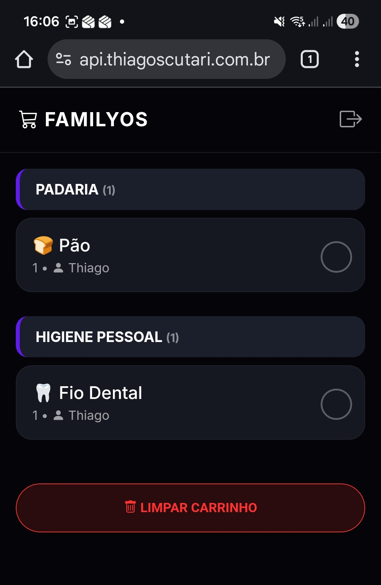
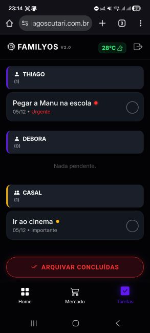
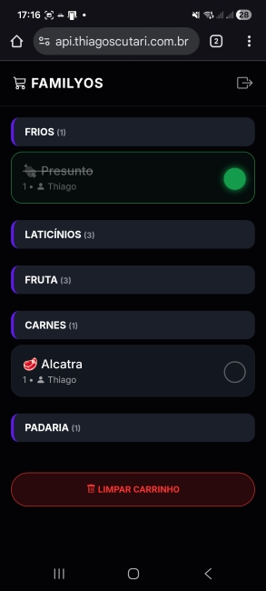
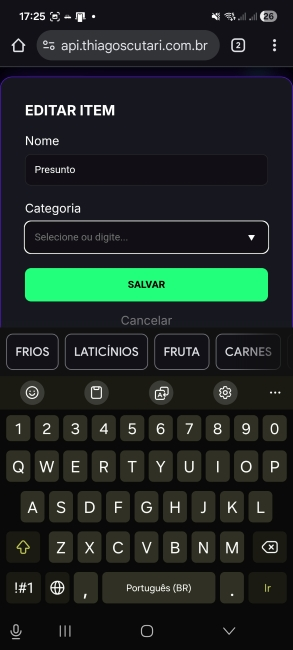
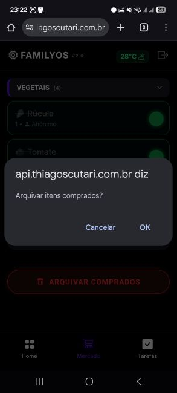
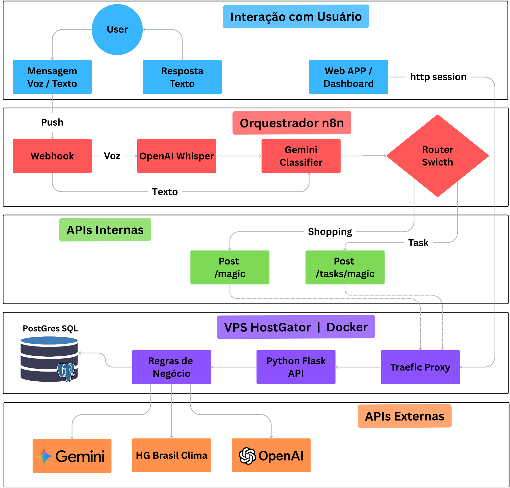

# 🏡 FamilyOS v2.0: The Home Operating System
### Software House Autônoma de Gestão Doméstica

O **FamilyOS** é um ecossistema de gestão doméstica "Zero UI". Ele elimina a fricção cognitiva de aplicativos tradicionais, permitindo que a família gerencie **Compras** e **Tarefas** usando apenas linguagem natural (áudio ou texto) no Telegram, enquanto uma Inteligência Artificial organiza tudo em um Dashboard Web Mobile-First.

> **Status:** ✅ Produção (Estável)
> **Versão:** 2.1 (Multi-Module)
> **Stack:** Python Flask, Docker, PostgreSQL, n8n, Google Gemini Pro e OpenAI-APIs.

---

## 🧠 O Conceito "Zero UI"

O sistema entende a intenção do usuário sem botões ou menus complexos.

### 1. Entrada de Dados (Telegram)
Você fala como se estivesse pedindo um favor a um assistente real.
* *"Comprar leite e pão"* -> Vai para o **Mercado**.
* *"Thiago precisa lavar o carro urgente"* -> Vai para **Tarefas** (Atribuído a Thiago, Alta Prioridade).
* *"Temos que ir ao cinema"* -> Vai para **Tarefas** (Atribuído ao Casal, Média Prioridade).


### 2. O Cérebro (Roteamento n8n + IA)
O **n8n** atua como o córtex frontal. Ele recebe o áudio, transcreve (Whisper) e usa um **Classificador de Intenção** (LLM) para decidir se aquilo é uma compra ou uma tarefa, encaminhando para a rota correta da API.


---

## 📱 Módulos do Sistema

O Frontend foi desenhado com o tema **Cyberpunk Dark Neon**, focado em uso noturno e alto contraste.

### 🛒 Módulo 1: Mercado (Shopping List)
Otimizado para o momento da compra. Os itens são categorizados automaticamente pela IA (Padaria, Açougue, Higiene) para facilitar o trajeto no supermercado.



### ✅ Módulo 2: Gestão de Tarefas (Task Board) [NOVO]
Um quadro de gestão de vida. A IA define automaticamente:
1.  **Responsável:** Thiago, Débora ou Casal (baseado no contexto da frase).
2.  **Prioridade:** 🔴 Alta (Urgente), 🟡 Média (Importante), 🟢 Baixa (Rotina).



---

## ✨ Experiência do Usuário (UX)

### Feedback Visual e Tátil
Ao concluir um item, o feedback é instantâneo (Optimistic UI). O item brilha em verde neon e o celular vibra, gerando satisfação dopaminérgica.



### Edição Poderosa (Long Press)
Errou algo? Segure o dedo por 800ms sobre qualquer item para abrir o Modal de Edição. O sistema possui *autocomplete* inteligente para categorias.



### Arquivamento (Soft Delete)
Mantenha a lista limpa. O botão de arquivar remove os itens concluídos da visão principal, mas mantém o histórico no banco de dados.



---

## 🏗️ Arquitetura e Workflow (DevOps)

Este projeto utiliza um ciclo de desenvolvimento profissional híbrido, garantindo estabilidade em produção e agilidade no desenvolvimento.



### 🔄 Ciclo de Vida do Código
1.  **Desenvolvimento Local (VS Code):**
    * O código Python roda nativamente no Windows para debug rápido.
    * O Banco de Dados (Postgres) roda isolado no Docker Desktop.
    * O **Ngrok** expõe a API local para a internet, permitindo testar o n8n em tempo real.
2.  **Versionamento (Git):**
    * Commits padronizados sobem para o GitHub (`main branch`).
3.  **Produção (VPS HostGator):**
    * O servidor puxa a versão estável do Git.
    * O Docker Compose orquestra a atualização dos containers sem downtime perceptível.

---

## 📂 Estrutura de Arquivos

### 🏠 Ambiente Local (Desenvolvimento)

```text
C:\Users\thiag\...\todo_market_list\
├── .env                   # Segredos Locais (Ngrok URL, DB Local)
├── .gitignore             # Arquivos ignorados pelo Git
├── docker-compose.yml     # Sobe apenas o DB Postgres para dev
├── requirements.txt       # Dependências Python
├── README.md              # Este arquivo
├── postgres_data_local/   # Persistência do Banco Local (Ignorado no Git)
├── docs/                  # Documentação Técnica (API, Specs, Setup)
├── images/                # Screenshots do README
├── tests/                 # Scripts de teste e experimentos
└── src/                   # Código Fonte da Aplicação
    ├── app.py             # Backend Flask (Rotas /magic e /tasks)
    ├── main.py            # Ponto de entrada auxiliar
    ├── reset_db.py        # Script para resetar/criar tabelas
    ├── ngrok.exe          # Executável do Túnel (Acesso Externo)
    ├── templates/         # Frontend (Jinja2)
    │   ├── base.html      # Layout Mestre (Nav + Header)
    │   ├── dashboard.html # Home (Nova)
    │   ├── shopping.html  # Módulo Mercado
    │   ├── tasks.html     # Módulo Tarefas
    │   ├── login.html     # Tela de Login
    │   └── index.html     # (Legado)
    └── static/            # CSS e Assets
        └── css/
            └── styles.css
```

### ☁️ Ambiente de Produção (VPS)

```text
/opt/n8n-traefik/          # Raiz da Infraestrutura
├── .env                   # Segredos de Produção
├── docker-compose.yml     # Orquestrador Completo (App + Banco + N8N + Traefik)
└── familyos/              # Repositório Clonado
    ├── Dockerfile         # Receita da Imagem
    └── src/               # Código Fonte Sincronizado
```

-----

## 🛠️ Stack Tecnológica

| Camada | Tecnologia | Função |
| :--- | :--- | :--- |
| **Interface** | Telegram Bot API | Entrada de dados Zero UI |
| **Orquestração** | n8n (Self-Hosted) | Lógica de Fluxo, Whisper, Roteamento |
| **Backend** | Python Flask | API REST, Regras de Negócio |
| **Banco de Dados** | **PostgreSQL 15** | Persistência Relacional Robusta |
| **Inteligência** | Google Gemini 1.5 | NLP, Classificação e Extração de Entidades |
| **Infra** | Docker & Traefik | Containerização e Proxy Reverso SSL |

-----

## 🗺️ Roadmap

| Versão | Foco | Status |
| :--- | :--- | :--- |
| **v1.0** | MVP Lista de Compras | ✅ Concluído |
| **v1.2** | Persistência e UX Mobile | ✅ Concluído |
| **v2.0** | **Módulo Tarefas & Postgres** | ✅ **Produção** |
| **v2.1** | Dashboard & Clima | 🚧 Em Breve |
| **v3.0** | Finanças & Orçamento | 🔮 Futuro |

-----

**Desenvolvido por:** Thiago Scutari.
*Automação Residencial levada a sério.*

```
