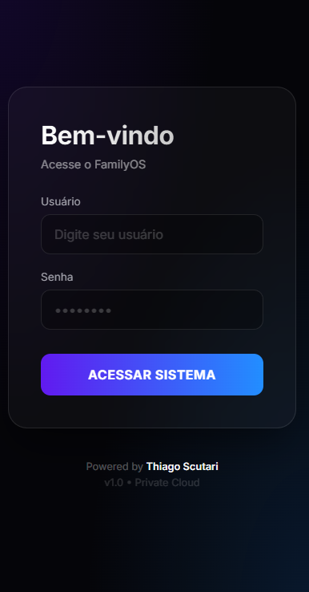
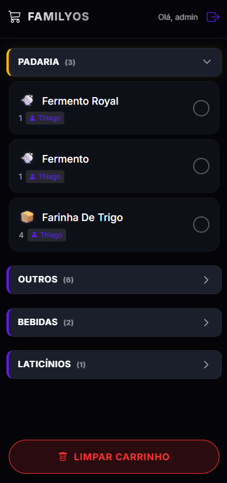
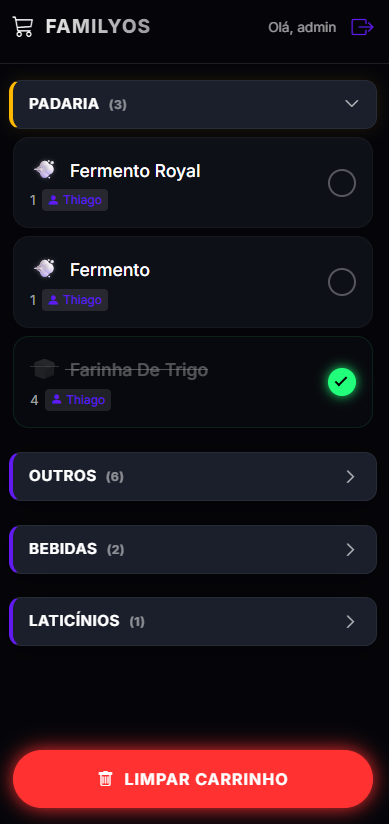

# 🛒 FamilyOS: ToDo Market & List
### Software House Autônoma de Gestão Doméstica

O **FamilyOS** é um sistema híbrido de gestão doméstica inteligente, focado em eliminar a **fricção cognitiva e operacional** na organização familiar. O foco inicial é o Módulo de Compras, que utiliza Inteligência Artificial para transformar áudios no Telegram em uma **Lista de Compras Web Interativa**.

---

## 💡 Showcase: O Fluxo de Uso

### 1. Entrada de Dados (Telegram)
A interface de entrada é o Telegram. O sistema aceita áudios com linguagem natural ("preciso de 3 ovos e uma caixa de leite") ou texto direto. O bot confirma o recebimento e valida os itens.


### 2. Orquestração (n8n & Backend)
O **n8n** atua como o sistema nervoso, recebendo o webhook do Telegram, processando o áudio via Whisper e enviando para a API Python estruturar os dados com Gemini.


### 3. Segurança e Acesso (Login)
O sistema conta com uma camada de autenticação para garantir que apenas a família tenha acesso à gestão da lista.


### 4. A Lista Inteligente (Web App)
Uma interface *mobile-first* limpa. O sistema agrupa automaticamente os itens por categorias (Padaria, Laticínios, etc.) para otimizar o trajeto dentro do supermercado.


### 5. Feedback Visual e Interatividade
Ao marcar um item, ele recebe um feedback visual imediato (check verde e risco), facilitando a visualização do que falta comprar. O estado é salvo em tempo real no banco de dados.


---

## 🏗️ Arquitetura Técnica (Sprint 5 - Produção)

A arquitetura evoluiu para um **Monólito Modular Inteligente**, hospedado em VPS com Docker e Traefik, garantindo segurança (HTTPS) e facilidade de deploy.


### Componentes Chave

| Componente | Função | Tecnologias Chave |
| :--- | :--- | :--- |
| **Interface de Entrada** | Captura de áudio/texto | Telegram Bot API |
| **Orquestrador** | Transcrição e Roteamento | n8n, OpenAI Whisper |
| **Cérebro (NLP)** | Extração de itens e Categorização | Google Gemini 2.5 Flash-Lite, LangChain |
| **Backend** | Regras de Negócio e Persistência | Python Flask, Gunicorn, SQLAlchemy |
| **Frontend** | Visualização e Controle | HTML5, CSS3 (Mobile-First), Jinja2, JS Fetch |
| **Infraestrutura** | Deploy e Segurança | Docker Compose, Traefik (Reverse Proxy + SSL) |

---

## 🎯 Funcionalidades do Módulo de Compras

### 1. Entrada Inteligente (`POST /magic`)
* **Processamento de Linguagem Natural (NLP):** O sistema entende contextos complexos. Ex: "2kg de carne moída para o almoço de domingo".
* **Normalização de Dados:** Converte plurais para singular, padroniza unidades de medida (ml, litros, kg) e corrige erros de digitação.
* **Anti-Duplicidade:** O algoritmo verifica se o item já existe na lista antes de adicionar. Se existir, ele apenas atualiza a quantidade ou ignora.
* **Rastreabilidade:** Identifica quem solicitou o item (ex: Thiago ou Esposa), útil para tirar dúvidas na hora da compra.

### 2. Interface de Compras Otimizada (`GET /`)
* **Design No-Zoom:** Botões grandes, checkboxes acessíveis e tipografia legível, projetados para serem usados com uma mão enquanto se empurra o carrinho.
* **Categorização Automática:** O Gemini classifica os itens em categorias reais de mercado (Hortifrúti, Limpeza, Açougue), evitando idas e vindas nos corredores.
* **Sincronização:** A lista é única para todos os usuários. Se alguém adiciona um item em casa, aparece instantaneamente para quem está no mercado.

### 3. Gestão de Estado e Persistência
* **Toggle em Tempo Real:** As rotas `POST /toggle_item` salvam o status (pendente/comprado) instantaneamente no SQLite via SQLAlchemy.
* **Limpeza de Carrinho:** A função `Clear Cart` permite arquivar todos os itens comprados de uma vez ao finalizar a feira, mantendo a lista limpa para a próxima semana.

---

## 🛠️ Setup e Desenvolvimento

Para rodar o projeto localmente:

1.  **Clonar o Repositório:**
    ```bash
    git clone [https://github.com/ThiagoScutari/todo_market_list.git](https://github.com/ThiagoScutari/todo_market_list.git)
    cd todo_market_list
    ```

2.  **Configurar Ambiente:**
    Crie o ambiente virtual e instale as dependências:
    ```bash
    python -m venv venv
    source venv/bin/activate  # Linux/Mac
    .\venv\Scripts\activate   # Windows
    pip install -r requirements.txt
    ```

3.  **Configurar Chaves (`.env`):**
    Crie um arquivo `.env` na raiz com suas chaves (especialmente `GOOGLE_API_KEY` para o Gemini).

4.  **Inicializar Banco de Dados:**
    Execute o script que cria o SQLite e popula as categorias base:
    ```powershell
    python src/reset_db.py
    ```

5.  **Rodar a Aplicação:**
    ```powershell
    python src/app.py
    ```
    * Acesse o Frontend: `http://localhost:5000`

---

## 🗺️ Roadmap de Desenvolvimento

| Sprint | Foco | Status |
| :--- | :--- | :--- |
| **Sprint 1** | Backend & Banco de Dados | ✅ Concluído |
| **Sprint 2** | Integração (n8n + Ngrok + NLP) | ✅ Concluído |
| **Sprint 3** | Frontend Web (Substituindo Notion) | ✅ Concluído |
| **Sprint 4** | Interatividade e Persistência | ✅ Concluído |
| **Sprint 5** | Deploy em Produção (Docker + VPS) | ✅ Concluído |

---

**Desenvolvido por:** Thiago Scutari & Equipe de Agentes (Alpha, Architect, Builder, Star).
**Tecnologia:** Google Gemini, Python, AI, Automation.